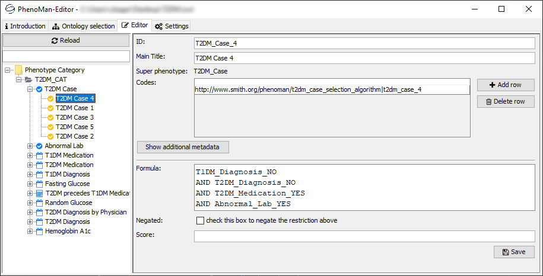

# PhenoMan-Editor

## Introduction
The PhenoMan-Editor is a GUI for the Java package **PhenoMan**. The Editor enables the user to create and modify
Phenotype Algorithm Specification Ontologies (PASO), which can further on be used to reason and calculate phenotypes for
individual subject data. PASOs are based on the **Core Ontology of Phenotypes**.

## How to use
1. Download a release from the [releases section](releases).
2. Run the JAR file, which is contained in the release (replace "x.x.x" with the actual version number of the release):
   ```shell script
   java -jar phenoman_editor-x.x.x.jar
   ```
3. Load a PASO or specify a path where a new one should be created.

4. Browse and edit the ontology.


## See also
* PhenoMan (release of source code is *pending*)
* [Smart Medical Information Technology for Healthcare](https://www.smith.care)
* [Core Ontology of Phenotypes](https://github.com/Onto-Med/COP)
* [Core Ontologies](https://en.wikipedia.org/wiki/Core_ontology)

## References
>Winter, A; Stäubert, S; Ammon, D; Aiche, S; Beyan, O; Bischoff, V; Daumke, P; Decker, S; Funkat, G; Gewehr, JE;
>de Greiff, A; Haferkamp, S; Hahn, U; Henkel, A; Kirsten, T; Klöss, T; Lippert, J; Löbe, M; Lowitsch, V; Maassen, O;
>Maschmann, J; Meister, S; Mikolajczyk, R; Nüchter, M; Pletz, MW; Rahm, E; Riedel, M; Saleh, K; Schuppert, A; Smers, S;
>Stollenwerk, A; Uhlig, S; Wendt, T; Zenker, S; Fleig, W; Marx, G; Scherag, A; Löffler, M:
>*Smart Medical Information Technology for Healthcare (SMITH)*. Methods Inf Med. 2018;57 S 01:e92–105.
>[10.3414/ME18-02-0004](https://doi.org/10.3414/ME18-02-0004)

>Uciteli, A; Beger, C; Kirsten, T; Meineke, FA; Heinrich H:
>*Ontological Modelling and Reasoning of Phenotypes*.
>Proceedings of the Joint Ontology Workshops 2019; Episode V: The Styrian Autumn of Ontology;
>Graz; Austria; September 23-25; 2019. [PDF](http://ceur-ws.org/Vol-2518/paper-ODLS11.pdf)